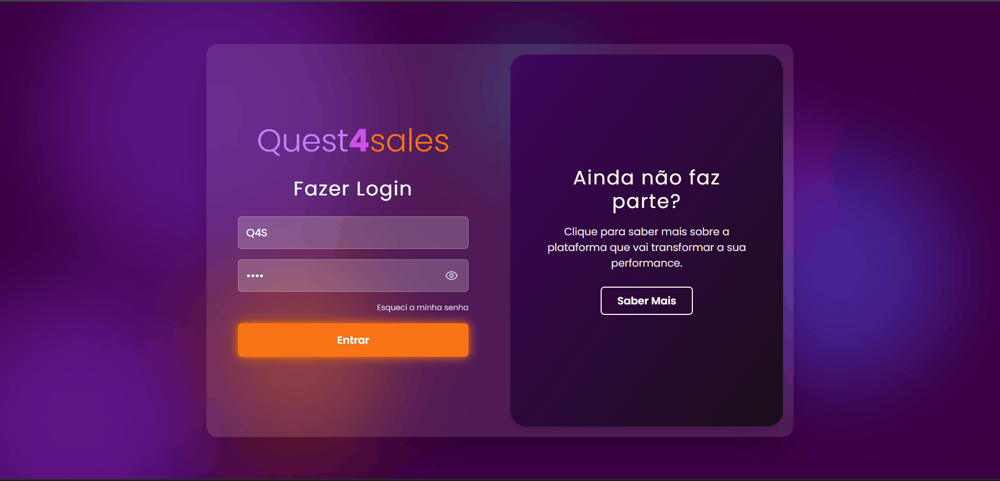

# Quest4Sales Frontend

Sistema de gamificação para equipes de vendas desenvolvido com React, TypeScript e Vite.

## Tela de Login



## Tecnologias

- **React** 19.2.0 - Biblioteca para construção de interfaces
- **TypeScript** 5.9.3 - Superset JavaScript com tipagem estática
- **Vite** 7.1.9 - Build tool e dev server
- **TailwindCSS** 3.0.0 - Framework CSS utilitário
- **React Router** 7.9.4 - Roteamento
- **React Hook Form** 7.64.0 - Gerenciamento de formulários
- **TanStack Query** 5.90.2 - Gerenciamento de estado assíncrono
- **Zod** 4.1.12 - Validação de schemas
- **Axios** 1.13.2 - Cliente HTTP
- **Recharts** 2.15.2 - Biblioteca de gráficos
- **Framer Motion** 12.23.22 - Animações
- **Radix UI** - Componentes acessíveis

## Requisitos

- Node.js 18+
- npm ou yarn

## Instalação

```bash
# Clone o repositório
git clone https://github.com/alana-britoc/quest4sales-frontend.git

# Instale as dependências
npm install
```

## Scripts Disponíveis

```bash
# Servidor de desenvolvimento
npm run dev

# Build para produção
npm run build

# Build para desenvolvimento
npm run build:dev

# Preview da build de produção
npm run preview

# Lint do código
npm run lint
```

## Estrutura do Projeto

```
quest4sales-frontend/
├── src/
│   ├── assets/        # Imagens e recursos estáticos
│   ├── components/    # Componentes React reutilizáveis
│   ├── pages/         # Páginas da aplicação
│   ├── services/      # Serviços e APIs
│   └── ...
├── public/            # Arquivos públicos
└── ...
```

## Desenvolvimento

O projeto utiliza ESLint para garantir a qualidade do código e Tailwind CSS para estilização. Todas as configurações estão prontas para uso.


